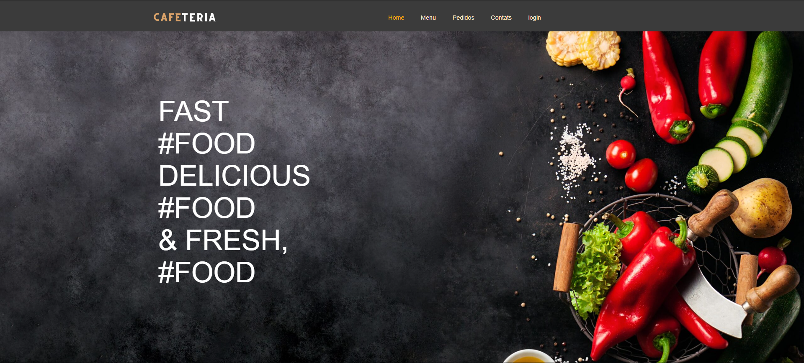
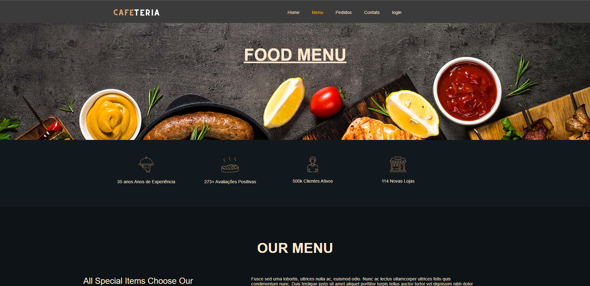
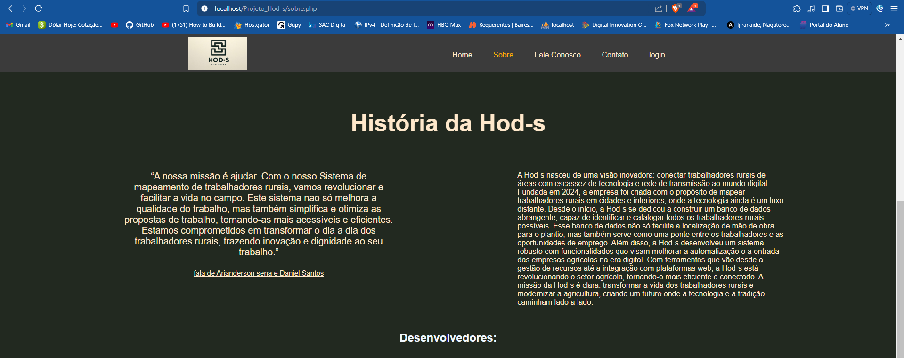
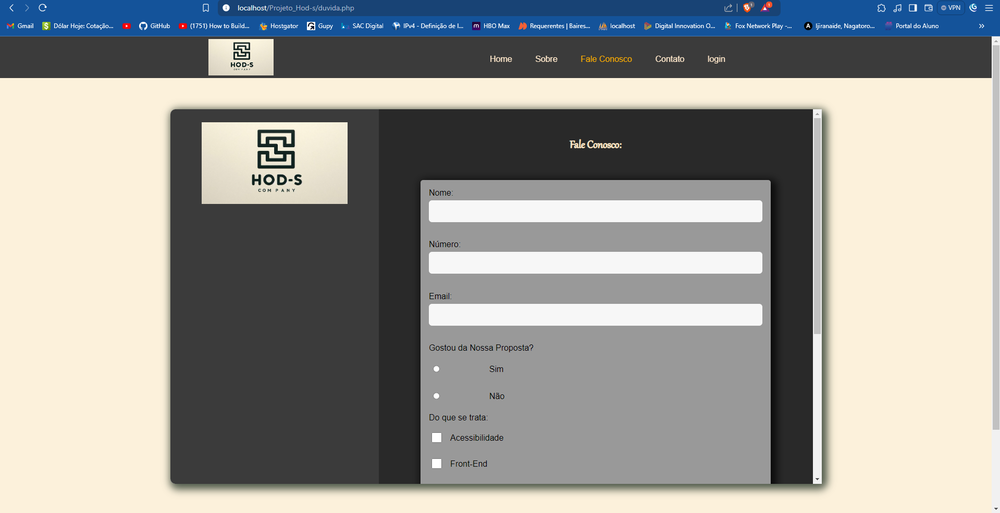
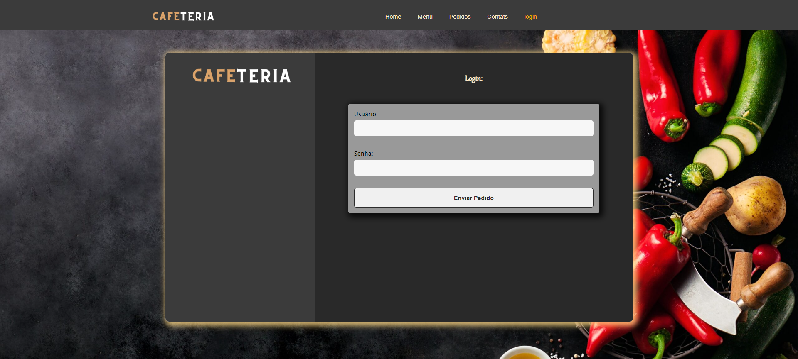
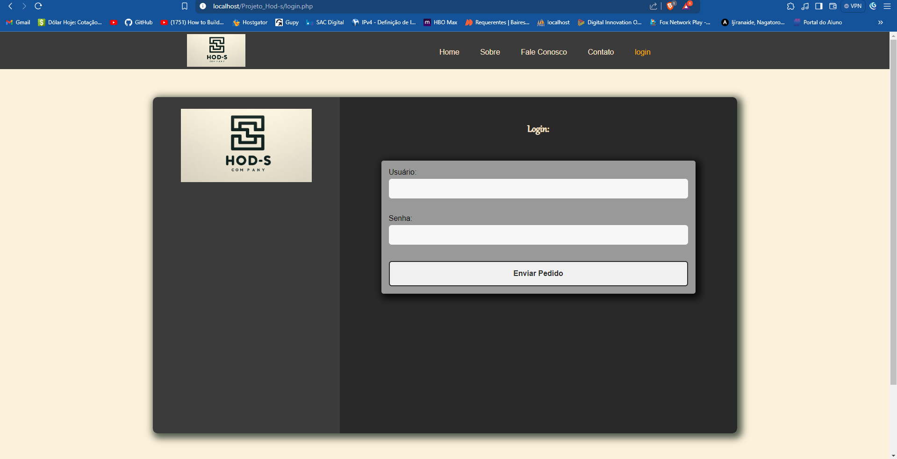

# Empresa_Hod-s
Documentação do Sistema Hod-s para Patente
1. Introdução
A Hod-s é uma empresa inovadora fundada em 2024 com a missão de conectar trabalhadores rurais de áreas com escassez de tecnologia e rede de transmissão ao mundo digital. Nosso objetivo é mapear trabalhadores rurais em cidades e interiores, onde a tecnologia ainda é um luxo distante, e criar um banco de dados abrangente para facilitar a localização de mão de obra e conectar trabalhadores a oportunidades de emprego.

2. Objetivo
O objetivo do sistema Hod-s é modernizar o setor agrícola, tornando-o mais eficiente e conectado. Através de um banco de dados robusto e ferramentas de gestão de recursos, o sistema visa melhorar a automatização e a entrada das empresas agrícolas na era digital.

3. Descrição do Sistema
3.1 Banco de Dados de Trabalhadores Rurais
Identificação e Catalogação: O sistema identifica e cataloga trabalhadores rurais em diversas regiões, criando um banco de dados abrangente.
Facilitação de Localização: O banco de dados facilita a localização de mão de obra para o plantio e outras atividades agrícolas.
Conexão com Oportunidades de Emprego: Serve como uma ponte entre trabalhadores rurais e oportunidades de emprego, promovendo a inclusão digital.
3.2 Funcionalidades do Sistema
Gestão de Recursos: Ferramentas para a gestão eficiente de recursos agrícolas.
Integração com Plataformas Web: Integração com diversas plataformas web para facilitar a comunicação e a gestão de dados.
Automatização de Processos: Funcionalidades que visam automatizar processos agrícolas, aumentando a eficiência e reduzindo custos operacionais.
4. Inovação e Impacto
A Hod-s está revolucionando o setor agrícola ao introduzir tecnologia em áreas rurais, promovendo a modernização e a eficiência. Nosso sistema não só melhora a gestão de recursos, mas também transforma a vida dos trabalhadores rurais, criando um futuro onde a tecnologia e a tradição caminham lado a lado.

5. Conclusão
A Hod-s é dedicada a transformar o setor agrícola através da inovação tecnológica. Nosso sistema esta sendo desenvolvido para ser robusto e abrangente, e esta sendo projetado para conectar trabalhadores rurais ao mundo digital, melhorar a eficiência das empresas agrícolas e promover a inclusão digital em áreas remotas.

